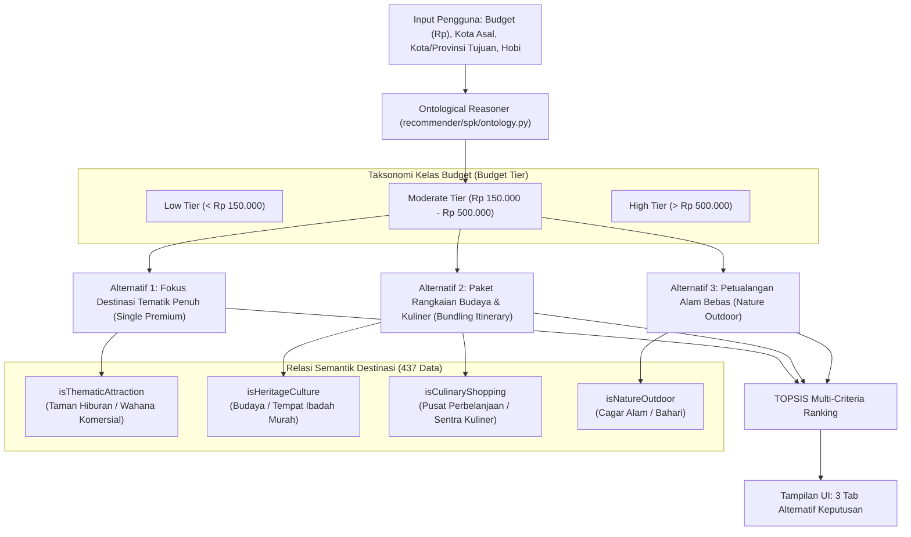

# Rencana Implementasi: Integrasi Konsep Ontologi Pariwisata pada SPK TravelFit

> **Catatan Basis Data**: Seluruh rancangan ini berbasis murni pada **Dataset Bersih 437 Destinasi** (`data/processed/destinations_clean.csv`) yang mencakup 5 wilayah utama di Pulau Jawa: **DKI Jakarta (84), Jawa Barat/Bandung (124), Jawa Tengah/Semarang (57), DI Yogyakarta (126), dan Jawa Timur/Surabaya (46)**, tanpa menyertakan provinsi Banten.

---

## 1. Latar Belakang & Pernyataan Masalah

### Kelemahan Sistem Saat Ini
Dalam SPK konvensional, kriteria biaya (C1) hanya diperlakukan sebagai **filter matematis kaku (*hard constraint*)**:
$$\text{Filter: } \text{Total\_Biaya} \le \text{Budget}$$
Jika pengguna memasukkan `Budget = Rp 500.000`:
* Hampir semua tempat wisata dengan tiket murah (Rp 0 s.d. Rp 25.000) lolos filter.
* Tempat wisata bertiket Rp 0 (misal masjid atau taman kota) disamaratakan dengan wahana komersial bertiket Rp 150.000, lalu disajikan dalam **satu tabel ranking tunggal yang datar**.
* Pengguna yang memiliki dana Rp 500.000 tidak mendapatkan arahan bagaimana sisa dananya dimanfaatkan secara optimal.

### Solusi Saran Dosen: Konsep Ontologi (Knowledge Representation)
Memanfaatkan **ontologi semantik** untuk memetakan budget ke dalam konsep kelas pengeluaran (*Tourism Budget Tier*), sehingga sistem menyajikan **3 Opsi Alternatif Skenario Perjalanan** yang berbeda secara esensial, bukan cuma memfilter harga tiket.

### Prinsip Minimum Asumsi
* **Nol Biaya Fiktif**: Sistem **tidak mengarang** perkiraan harga makanan per warung atau biaya parkir liar yang tidak ada datanya.
* **Murni Data Empiris 437**: Seluruh inferensi hanya memanfaatkan kolom faktual yang telah terverifikasi di dataset 437:
  1. `price` / `c1_ticket_price` (Harga tiket masuk riil dalam Rupiah)
  2. `category` & `category_clean` (`hiburan`, `budaya`, `alam`, `bahari`, `religi`, `belanja`)
  3. `city` & `province` (Kedekatan geografis di kota yang sama)
  4. `rating` & `c2_rating` (Ulasan riil Google Maps)
  5. `facility_*_mentioned` & `c4_facility_score` (Kelengkapan fasilitas riil)
  6. `activity_tags` (Tag aktivitas faktual)

---

## 2. Model Ontologi Pariwisata (Taksonomi & Relasi Semantik)



---

## 3. Simulasi 3 Opsi Alternatif Menggunakan Data Riil 437

Berikut simulasi nyata bagaimana sistem mengolah data jika pengguna memasukkan `Budget = Rp 500.000`:

### Contoh Wilayah 1: DI Yogyakarta (126 Data Riil)
* **Alternatif 1 (Single Thematic Destination)**:
  * *Destinasi*: **Jogja Bay Pirates Waterpark** atau **Sindu Kusuma Edupark** (Kategori: Taman Hiburan, Tiket: Rp 60.000 – Rp 100.000).
  * *Karakter*: Pengguna menghabiskan waktu seharian di 1 lokasi berfasilitas lengkap.
* **Alternatif 2 (Bundling Heritage & Kuliner)**:
  * *Destinasi*: **Keraton Yogyakarta** (Tiket Rp 15.000) + **Taman Sari** (Tiket Rp 15.000) + **Kawasan Malioboro / Pasar Beringharjo** (Tiket Rp 0).
  * *Alokasi Budget*: Total tiket hanya Rp 30.000; sisa dana Rp 470.000 dialokasikan penuh untuk berbelanja batik dan kuliner gudeg khas Jogja.
* **Alternatif 3 (Nature Outdoor Adventure)**:
  * *Destinasi*: **Gunung Api Purba Nglanggeran** (Tiket Rp 15.000) atau **Hutan Pinus Mangunan** (Tiket Rp 5.000).
  * *Karakter*: Tiket sangat murah; sisa dana memberi fleksibilitas untuk sewa jeep lava tour Merapi atau aktivitas luar ruang.

---

### Contoh Wilayah 2: DKI Jakarta (84 Data Riil)
* **Alternatif 1 (Single Thematic Destination)**:
  * *Destinasi*: **Dunia Fantasi (Dufan)** (Tiket Rp 225.000) atau **Sea World Ancol** (Tiket Rp 115.000).
  * *Karakter*: Wisata terpusat dengan wahana permainan kelas satu.
* **Alternatif 2 (Bundling Heritage & Kuliner)**:
  * *Destinasi*: **Museum Fatahillah / Kota Tua** (Tiket Rp 5.000) + **Museum Bank Indonesia** (Tiket Rp 5.000) + **Sentra Kuliner Glodok / Petak Sembilan** (Tiket Rp 0).
  * *Alokasi Budget*: Total tiket hanya Rp 10.000; sisa dana dialokasikan untuk kuliner legendaris Jakarta.
* **Alternatif 3 (Nature Outdoor Adventure)**:
  * *Destinasi*: **Ekowisata Mangrove PIK** (Tiket Rp 30.000) atau wisata pulau di **Kepulauan Seribu**.

---

### Contoh Wilayah 3: Jawa Barat / Bandung (124 Data Riil)
* **Alternatif 1 (Single Thematic Destination)**:
  * *Destinasi*: **Trans Studio Bandung** (Tiket Rp 200.000) atau **Farmhouse Lembang** (Tiket Rp 30.000).
* **Alternatif 2 (Bundling Heritage & Kuliner)**:
  * *Destinasi*: **Gedung Sate** (Tiket Rp 5.000) + **Jalan Braga** (Tiket Rp 0) + **Pasar Baru Trade Center Bandung** (Tiket Rp 0).
* **Alternatif 3 (Nature Outdoor Adventure)**:
  * *Destinasi*: **Kawah Putih Ciwidey** (Tiket Rp 28.000) atau **Tebing Keraton** (Tiket Rp 15.000).

---

## 4. Desain Teknis & Modifikasi Codebase

### A. Modul Baru: `recommender/spk/ontology.py`
Modul ini bertugas menjalankan inferensi semantik secara deterministik:
```python
# recommender/spk/ontology.py

class TourismOntology:
    """Mesin penalaran ontologi pariwisata berbasis data 437 tanpa asumsi baru."""

    @staticmethod
    def classify_budget_tier(budget: float) -> str:
        if budget < 150000:
            return "LOW"
        elif budget <= 500000:
            return "MODERATE"
        else:
            return "HIGH"

    @classmethod
    def generate_alternatives(cls, destinations_qs, budget: float, weights: list, is_cost: list):
        """
        Menghasilkan 3 opsi alternatif perjalanan:
        1. Single Thematic: Taman Hiburan bertiket reguler/menengah.
        2. Heritage & Culinary: Pasangan Budaya/Religi murah + Pusat Belanja/Pasar di kota yang sama.
        3. Nature Outdoor: Wisata Bahari / Cagar Alam.
        """
        tier = cls.classify_budget_tier(budget)
        
        # 1. Kandidat Single Thematic (Taman Hiburan)
        thematic_pool = [d for d in destinations_qs if d.kategori == "Taman Hiburan" and d.harga_tiket <= budget]
        
        # 2. Kandidat Heritage & Kuliner (Pasangan Kota yang sama)
        heritage_pool = [d for d in destinations_qs if d.kategori in ["Budaya", "Tempat Ibadah"] and d.harga_tiket <= 25000]
        culinary_pool = [d for d in destinations_qs if d.kategori == "Pusat Perbelanjaan"]
        
        # 3. Kandidat Nature Outdoor
        nature_pool = [d for d in destinations_qs if d.kategori in ["Cagar Alam", "Bahari"] and d.harga_tiket <= budget]
        
        # Masing-masing pool di-ranking secara independen via TOPSIS
        # Return dict berisi 3 skenario terstruktur
        return {
            "tier": tier,
            "opsi_thematic": thematic_pool,
            "opsi_heritage_culinary": {"heritage": heritage_pool, "culinary": culinary_pool},
            "opsi_nature": nature_pool,
        }
```

### B. Modifikasi View: `recommender/views.py`
* Memanggil `TourismOntology.generate_alternatives()` setelah validasi form preferensi.
* Menyalurkan struktur `alternatives` ke template context `_hasil.html`.

### C. Modifikasi Antarmuka (UI): `recommender/templates/recommender/_hasil.html`
* Menambahkan **Tab Navigasi Skenario** di atas tabel hasil:
  * Tab 1: 🎟️ **Rekreasi Tematik Mandiri** (Fokus 1 destinasi berbayar lengkap)
  * Tab 2: 🏛️ **Jelajah Budaya & Kuliner** (Paket hemat budaya + sentra kuliner)
  * Tab 3: 🌊 **Petualangan Alam Luar Ruang** (Wisata alam & eksplorasi)
* Setiap tab menampilkan kartu ringkasan alokasi budget dan tabel ranking TOPSIS masing-masing.

---

## 5. Rencana Tahapan Eksekusi (Implementation Steps)

| No | Tahapan | File / Komponen | Luaran yang Diharapkan |
|:---:|:---|:---|:---|
| **1** | **Pembuatan Modul Ontologi** | `recommender/spk/ontology.py` | Modul murni Python tanpa network yang mengklasifikasikan 437 destinasi ke 3 jalur skenario. |
| **2** | **Unit Testing Modul Ontologi** | `recommender/tests/test_ontology.py` | Uji coba unit test untuk skenario budget: Rp 100k (Low), Rp 500k (Moderate), dan Rp 1jt (High). |
| **3** | **Integrasi ke View Rekomendasi** | `recommender/views.py` | View memproses perankingan TOPSIS untuk masing-masing opsi ontologi. |
| **4** | **Pembaruan Template UI** | `recommender/templates/recommender/_hasil.html` | Desain antarmuka 3 tab responsif dengan penjelasan alokasi budget tiap opsi. |
| **5** | **Verifikasi Regresi Sistem** | Django Test Suite (`manage.py test`) | Memastikan seluruh 54 unit test yang ada tetap **100% OK**. |

---

## 6. Nilai Tambah untuk Sidang / Laporan Skripsi
1. **Memenuhi Arahan Dosen Secara Ilmiah**: Membuktikan bahwa sistem tidak sekadar menjalankan rumus matematika TOPSIS, melainkan mengadopsi pilar **Knowledge Representation (Representasi Pengetahuan / Ontologi)**.
2. **Bebas dari Bias Asumsi**: Tidak ada angka buatan yang mengada-ada; seluruh opsi diturunkan secara logis dari data empiris 437 yang sudah valid.
3. **Nilai Praktis Tinggi (*High Usability*)**: Pengguna yang memiliki budget Rp 500.000 mendapatkan opsi nyata sesuai preferensi gaya perjalanannya.
